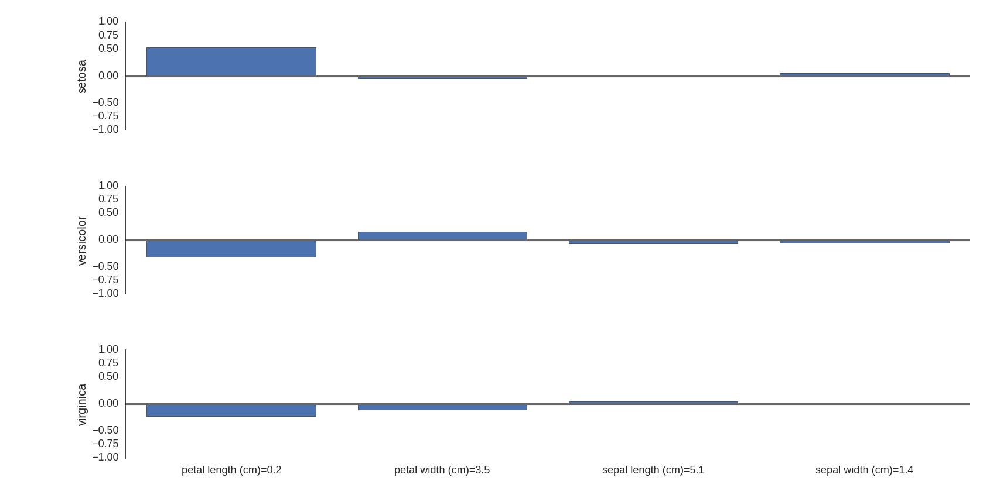

# explain-scikit-learn
Create wrappers around scikit-learn classifiers which explain how they make their decisions. The wrapper will work for any classifier with a `predict_proba` method.

The tools helps you to answer the question: "How did the features present in this instance affect the classifier's choice?"

For example, the following graph is the output on an instance from the Iris dataset, explaining how a logistic regression model viewed each feature's value as evidence for or against each class. The logistic regression model classifies this as "setosa".




The example was implemented using the following code, which takes a scikit-learn model and input data to train it on, and produces an analyzer object:
```
data = datasets.load_iris()
model = LogisticRegression()
target = [data.target_names[t] for t in data.target]
analyzer = analyze.ExplainableClassifier(data.data, target, data.feature_names, model)
explanation = analyzer.explain_classification(data.data[0])
analyze.BarPlot(explanation)
```

This is an implementation of the classification explanation method described by:
  Erik Strumbelj and Igor Kononenko, "An Efficient Explanation of Individual Classifications using Game Theory", Journal of Machine Learning Research, 2010.
  
