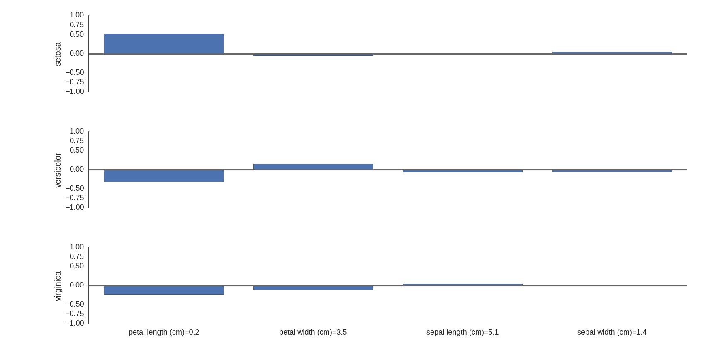

# explain-scikit-learn
Turn any scikit-learn classifier into an interpretable model by adding a lightweight wrapper. The wrapper will work for any classifier with a `predict_proba` method.

The tools helps you to answer the question: "How did the features present in this instance affect my classifier's choice?"

For example, the following graph is the output on an instance from the Iris dataset, explaining how a logistic regression model viewed each feature's value as evidence for or against each class. The logistic regression model correctly classifies this as "setosa".




The example can be reproduced with this code, which shows you how to use the wrapper - initialize your model and add it to the ExplainableClassifier class, then train it as you normally would. Once it's trained, you can use the `explain classification` method to get an explanation for any classificaiton of an input you specify.

```
from explain_sklearn import analyze
from sklearn.linear_model import LogisticRegression
from sklearn import datasets

data = datasets.load_iris()
model = LogisticRegression()
target = [data.target_names[t] for t in data.target]
explainable_model = analyze.ExplainableClassifier(data.feature_names, model)
explainable_model.fit(data.data, target)
explanation = explainable_model.explain_classification(data.data[0])
analyze.BarPlot(explanation)
```

The main algorithm used by this tool is an implementation of the classification explanation method described by:
  [Erik Strumbelj and Igor Kononenko, "An Efficient Explanation of Individual Classifications using Game Theory", Journal of Machine Learning Research.](http://lkm.fri.uni-lj.si/xaigor/slo/pedagosko/dr-ui/jmlr-strumbelj-kononenko.pdf)
  
